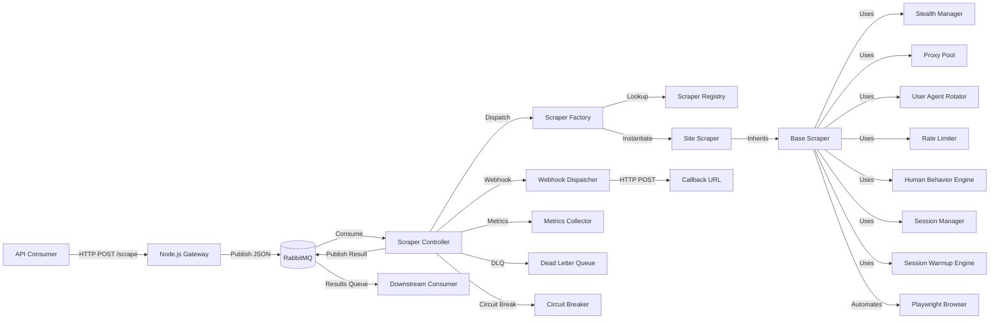
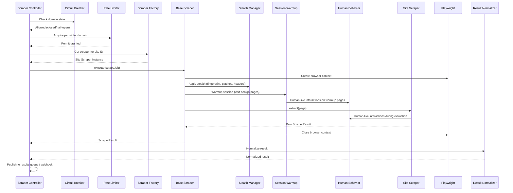
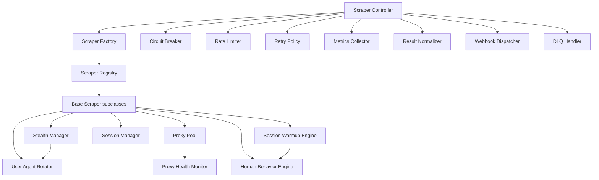

# Design Document: TenguS Web Scraper Service

## Overview

TenguS is a modular, scalable web scraper service built in Kotlin. The system decouples job submission from execution via a Node.js HTTP gateway and RabbitMQ message queue, with a Kotlin scraper controller that consumes jobs and dispatches site-specific scrapers through a factory/registry pattern. Each site scraper inherits from a base class providing stealth, anti-detection, rate limiting, proxy rotation, and human-like interaction capabilities. Headless Playwright handles browser automation. No database is used — all state is transient or queue-based.

### Key Design Decisions

1. **Playwright Java bindings** (`com.microsoft.playwright`): Official Microsoft-maintained JVM bindings for Playwright, providing full browser automation with Chromium, Firefox, and WebKit support. Kotlin interop is seamless since Playwright Java is a standard Java library.

2. **RabbitMQ Java Client** (`com.rabbitmq:amqp-client`): The official RabbitMQ AMQP client for JVM. Mature, well-documented, and supports all required queue operations including dead-letter exchanges, manual acknowledgment, and queue inspection.

3. **Jackson with Kotlin module** (`com.fasterxml.jackson.module:jackson-module-kotlin`): Industry-standard JSON serialization for JVM. The Kotlin module provides data class support, null safety awareness, and default parameter handling.

4. **Kotest with Property Testing** (`io.kotest:kotest-property`): Kotlin-native testing framework with built-in property-based testing. Provides idiomatic Kotlin generators (Arb), shrinking, and integrates with JUnit 5 runner.

5. **Custom Circuit Breaker**: A lightweight, domain-specific circuit breaker implementation rather than Resilience4j. The requirements specify per-domain state tracking with custom cooldown and half-open semantics that are simpler to implement directly than to configure through Resilience4j's generic API.

6. **YAML configuration via SnakeYAML** (`org.yaml:snakeyaml`): Lightweight YAML parser for loading configuration files at startup.

7. **Template Method pattern** for Base_Scraper lifecycle: The base class defines the scraping lifecycle (init → stealth → extract → collect → close), with site-specific scrapers overriding only the extraction step.

8. **Strategy pattern** for pluggable components: Stealth_Manager, Proxy_Pool, User_Agent_Rotator, Rate_Limiter, Human_Behavior_Engine, and Session_Manager are all injected as dependencies into Base_Scraper, enabling independent testing and replacement.

9. **Classpath scanning for scraper discovery**: The Scraper_Registry scans a configurable package at startup using Kotlin reflection to discover all Base_Scraper subclasses, eliminating the need for manual registration.

## Architecture

### System Architecture Diagram



### Scraper Lifecycle Sequence



### Component Dependency Diagram




## Components and Interfaces

### 1. Gateway (Node.js — out of Kotlin scope)

The Node.js gateway is a thin HTTP service. It validates incoming scrape job payloads, serializes them as JSON, publishes to RabbitMQ, and returns HTTP 202. It also exposes `/health`. The Kotlin design does not implement the gateway but defines the shared message contract.

### 2. Scraper Controller

The central orchestrator on the Kotlin side. Consumes messages from RabbitMQ, coordinates all components, and manages the scrape lifecycle.

```kotlin
class ScraperController(
    private val connectionFactory: ConnectionFactory,
    private val scraperFactory: ScraperFactory,
    private val circuitBreaker: CircuitBreakerManager,
    private val rateLimiter: RateLimiter,
    private val retryPolicyResolver: RetryPolicyResolver,
    private val resultNormalizer: ResultNormalizer,
    private val webhookDispatcher: WebhookDispatcher,
    private val metricsCollector: MetricsCollector,
    private val config: AppConfig
) {
    fun start()
    fun shutdown()
    fun handleMessage(delivery: Delivery)
    fun dispatchJob(job: ScrapeJob)
    fun publishResult(result: NormalizedScrapeResult)
    fun routeToDeadLetterQueue(job: ScrapeJob, reason: String, retryCount: Int)
    fun listDeadLetterMessages(): List<DeadLetterEntry>
    fun replayDeadLetterMessage(jobId: String)
    fun purgeDeadLetterMessage(jobId: String)
}
```

### 3. Scraper Factory

Maps site identifiers to Site_Scraper classes. Delegates all lookups to the Scraper_Registry.

```kotlin
class ScraperFactory(
    private val registry: ScraperRegistry,
    private val stealthManager: StealthManager,
    private val proxyPool: ProxyPool,
    private val userAgentRotator: UserAgentRotator,
    private val rateLimiter: RateLimiter,
    private val sessionManager: SessionManager,
    private val humanBehaviorEngine: HumanBehaviorEngine,
    private val sessionWarmupEngine: SessionWarmupEngine
) {
    fun createScraper(siteId: String): BaseScraper
}
```

### 4. Scraper Registry

Auto-discovers Site_Scraper implementations at startup via classpath scanning.

```kotlin
class ScraperRegistry(private val scanPackage: String) {
    fun discover()
    fun register(siteId: String, scraperClass: KClass<out BaseScraper>)
    fun lookup(siteId: String): KClass<out BaseScraper>
    fun registeredSiteIds(): Set<String>
}
```

### 5. Base Scraper (Abstract)

Template Method pattern. Defines the scraping lifecycle; site scrapers override `extract()`.

```kotlin
abstract class BaseScraper(
    private val stealthManager: StealthManager,
    private val proxyPool: ProxyPool,
    private val userAgentRotator: UserAgentRotator,
    private val sessionManager: SessionManager,
    private val humanBehaviorEngine: HumanBehaviorEngine,
    private val sessionWarmupEngine: SessionWarmupEngine
) {
    abstract val siteId: String
    abstract fun extract(page: Page, job: ScrapeJob): ScrapeResult

    fun execute(job: ScrapeJob): ScrapeResult  // Template method
}
```

### 6. Stealth Manager

Handles fingerprint randomization, bot detection patches, and header normalization.

```kotlin
class StealthManager(
    private val userAgentRotator: UserAgentRotator,
    private val config: StealthConfig
) {
    fun generateFingerprintProfile(userAgent: String): FingerprintProfile
    fun applyFingerprint(context: BrowserContext, profile: FingerprintProfile)
    fun applyBotDetectionPatches(context: BrowserContext)
    fun normalizeHeaders(context: BrowserContext, userAgent: String)
}
```

### 7. Proxy Pool

Manages proxy endpoints with rotation, health tracking, and recovery.

```kotlin
class ProxyPool(
    private val config: ProxyConfig,
    private val healthMonitor: ProxyHealthMonitor
) {
    fun selectProxy(domain: String): ProxyEndpoint
    fun markUnhealthy(proxy: ProxyEndpoint)
    fun restoreProxy(proxy: ProxyEndpoint)
    fun healthyProxiesForDomain(domain: String): List<ProxyEndpoint>
}
```

### 8. Proxy Health Monitor

Tracks per-proxy-per-domain failure rates and proactively removes blocked proxies.

```kotlin
class ProxyHealthMonitor(private val config: ProxyHealthConfig) {
    fun recordSuccess(proxy: ProxyEndpoint, domain: String)
    fun recordFailure(proxy: ProxyEndpoint, domain: String, signal: BlockingSignal)
    fun isBlocked(proxy: ProxyEndpoint, domain: String): Boolean
    fun scheduleRecheck(proxy: ProxyEndpoint, domain: String)
    fun classifyBlockingSignal(statusCode: Int, responseBody: String?): BlockingSignal?
}
```

### 9. User Agent Rotator

Weighted-random selection of user-agent strings with consecutive-different guarantee per domain.

```kotlin
class UserAgentRotator(private val config: UserAgentConfig) {
    fun select(domain: String): String
    fun availableAgents(): List<WeightedUserAgent>
}
```

### 10. Rate Limiter

Per-domain sliding window rate limiter.

```kotlin
class RateLimiter(private val config: RateLimitConfig) {
    fun acquire(domain: String)  // Blocks until permit available
    fun tryAcquire(domain: String): Boolean
    fun configForDomain(domain: String): DomainRateLimit
}
```

### 11. Human Behavior Engine

Provides human-like interaction utilities.

```kotlin
class HumanBehaviorEngine(private val config: HumanBehaviorConfig) {
    suspend fun randomDelay(minMs: Long, maxMs: Long)
    suspend fun typeText(page: Page, selector: String, text: String)
    suspend fun scrollPage(page: Page)
    suspend fun moveMouse(page: Page, x: Double, y: Double)
    suspend fun clickElement(page: Page, selector: String)
    suspend fun interActionDelay()
}
```

### 12. Session Manager

Manages per-job cookie isolation using Playwright browser contexts.

```kotlin
class SessionManager {
    fun createSession(jobId: String): BrowserContext
    fun destroySession(jobId: String)
}
```

### 13. Session Warmup Engine

Navigates benign pages before extraction to build realistic browsing profile.

```kotlin
class SessionWarmupEngine(
    private val humanBehaviorEngine: HumanBehaviorEngine,
    private val config: WarmupConfig
) {
    suspend fun warmup(context: BrowserContext, page: Page)
}
```

### 14. Circuit Breaker Manager

Per-domain circuit breaker with closed/open/half-open states.

```kotlin
class CircuitBreakerManager(private val config: CircuitBreakerConfig) {
    fun checkState(domain: String): CircuitState
    fun recordSuccess(domain: String)
    fun recordFailure(domain: String)
    fun getState(domain: String): CircuitState
    fun configForDomain(domain: String): DomainCircuitBreakerConfig
}

enum class CircuitState { CLOSED, OPEN, HALF_OPEN }
```

### 15. Retry Policy Resolver

Resolves per-site or global retry strategy.

```kotlin
class RetryPolicyResolver(private val config: RetryConfig) {
    fun resolve(siteId: String): RetryStrategy
    fun computeDelay(strategy: RetryStrategy, attempt: Int): Long
}

data class RetryStrategy(
    val maxRetries: Int,
    val backoffType: BackoffType,  // FIXED, LINEAR, EXPONENTIAL
    val baseDelayMs: Long,
    val jitterRangeMs: LongRange
)

enum class BackoffType { FIXED, LINEAR, EXPONENTIAL }
```

### 16. Result Normalizer

Transforms raw scrape results into a standardized schema.

```kotlin
class ResultNormalizer(private val schema: ResultSchema) {
    fun normalize(result: ScrapeResult, job: ScrapeJob): NormalizedScrapeResult
    fun validate(normalized: NormalizedScrapeResult): ValidationResult
}
```

### 17. Webhook Dispatcher

Delivers results to callback URLs with HMAC signing and retry.

```kotlin
class WebhookDispatcher(private val config: WebhookConfig) {
    fun dispatch(callbackUrl: String, payload: NormalizedScrapeResult)
    fun dispatchFailure(callbackUrl: String, failure: JobFailureNotification)
    fun computeHmac(body: ByteArray): String
}
```

### 18. Metrics Collector

Emits structured JSON metrics to stdout.

```kotlin
class MetricsCollector(private val config: MetricsConfig) {
    fun emitSuccess(jobId: String, siteId: String, durationMs: Long)
    fun emitFailure(jobId: String, siteId: String, reason: String, retryCount: Int)
    fun emitRollingRates()
    fun emitQueueDepths(jobsQueueDepth: Int, dlqDepth: Int)
    fun emitAverageDurations()
    fun emitProxyHealth(healthyCount: Map<String, Int>, blockedCount: Map<String, Int>)
}
```


## Data Models

### Core Domain Objects

```kotlin
// --- Scrape Job ---
data class ScrapeJob(
    val jobId: String,
    val targetUrl: String,
    val siteId: String,
    val callbackUrl: String? = null,
    val parameters: Map<String, Any> = emptyMap(),
    val retryCount: Int = 0,
    val createdAt: Instant = Instant.now()
)

// --- Scrape Result ---
data class ScrapeResult(
    val jobId: String,
    val siteId: String,
    val sourceUrl: String,
    val extractedAt: Instant,
    val data: Map<String, Any>
)

// --- Normalized Scrape Result (common schema) ---
data class NormalizedScrapeResult(
    val jobId: String,
    val siteId: String,
    val sourceUrl: String,
    val extractionTimestamp: Instant,
    val scraperVersion: String,
    val data: Map<String, Any>
)

// --- Dead Letter Entry ---
data class DeadLetterEntry(
    val jobId: String,
    val siteId: String,
    val originalPayload: ScrapeJob,
    val failureReason: String,
    val retryCount: Int,
    val enqueuedAt: Instant
)

// --- Job Failure Notification (for webhooks) ---
data class JobFailureNotification(
    val jobId: String,
    val siteId: String,
    val failureReason: String,
    val timestamp: Instant
)
```

### Stealth and Fingerprint Models

```kotlin
data class FingerprintProfile(
    val viewport: ViewportSize,
    val timezone: String,
    val language: String,
    val platform: String,
    val userAgent: String,
    val webglVendor: String,
    val webglRenderer: String
)

data class ViewportSize(val width: Int, val height: Int)

data class WeightedUserAgent(
    val userAgent: String,
    val weight: Double,
    val browserFamily: String,
    val browserVersion: String
)
```

### Proxy Models

```kotlin
data class ProxyEndpoint(
    val host: String,
    val port: Int,
    val username: String? = null,
    val password: String? = null,
    val protocol: String = "http"
)

enum class BlockingSignal {
    HTTP_403,
    CAPTCHA_CHALLENGE,
    CONNECTION_RESET
}
```

### Configuration Models

```kotlin
data class AppConfig(
    val rabbitmq: RabbitMqConfig,
    val rateLimiter: RateLimitConfig,
    val proxy: ProxyConfig,
    val userAgent: UserAgentConfig,
    val retry: RetryConfig,
    val humanBehavior: HumanBehaviorConfig,
    val stealth: StealthConfig,
    val circuitBreaker: CircuitBreakerConfig,
    val warmup: WarmupConfig,
    val webhook: WebhookConfig,
    val metrics: MetricsConfig,
    val shutdown: ShutdownConfig,
    val scraperRegistry: ScraperRegistryConfig
)

data class RabbitMqConfig(
    val host: String,
    val port: Int,
    val username: String,
    val password: String,
    val jobsQueue: String,
    val resultsQueue: String,
    val dlqQueue: String
)

data class RateLimitConfig(
    val defaultMaxRequests: Int,
    val defaultWindowMs: Long,
    val domainOverrides: Map<String, DomainRateLimit> = emptyMap()
)

data class DomainRateLimit(val maxRequests: Int, val windowMs: Long)

data class ProxyConfig(
    val endpoints: List<ProxyEndpoint>,
    val connectTimeoutMs: Long,
    val healthCheckIntervalMs: Long
)

data class ProxyHealthConfig(
    val slidingWindowMs: Long,
    val failureRateThreshold: Double,
    val cooldownMs: Long
)

data class UserAgentConfig(
    val agents: List<WeightedUserAgent>
)

data class RetryConfig(
    val globalMaxRetries: Int,
    val globalBackoffType: BackoffType,
    val globalBaseDelayMs: Long,
    val globalJitterRangeMs: LongRange,
    val perSiteOverrides: Map<String, RetryStrategy> = emptyMap()
)

data class HumanBehaviorConfig(
    val initialDelayRange: LongRange = 1000L..5000L,
    val keystrokeDelayRange: LongRange = 50L..200L,
    val scrollPauseRange: LongRange = 300L..1500L,
    val interActionDelayRange: LongRange = 500L..3000L
)

data class StealthConfig(
    val viewports: List<ViewportSize>,
    val timezones: List<String>,
    val languages: List<String>,
    val platforms: List<String>,
    val webglVendors: List<String>,
    val webglRenderers: List<String>
)

data class CircuitBreakerConfig(
    val defaultFailureThreshold: Int,
    val defaultCooldownMs: Long,
    val domainOverrides: Map<String, DomainCircuitBreakerConfig> = emptyMap()
)

data class DomainCircuitBreakerConfig(
    val failureThreshold: Int,
    val cooldownMs: Long
)

data class WarmupConfig(
    val urls: List<String>,
    val minPages: Int,
    val maxPages: Int,
    val pageTimeoutMs: Long
)

data class WebhookConfig(
    val hmacSecret: String,
    val maxRetries: Int,
    val baseDelayMs: Long
)

data class MetricsConfig(
    val reportingIntervalMs: Long,
    val slidingWindowMs: Long
)

data class ShutdownConfig(
    val gracePeriodSeconds: Int
)

data class ScraperRegistryConfig(
    val scanPackage: String
)

// --- Metrics Output Models ---
data class SuccessMetric(
    val metricType: String = "scrape_success",
    val jobId: String,
    val siteId: String,
    val durationMs: Long,
    val status: String = "success",
    val timestamp: Instant
)

data class FailureMetric(
    val metricType: String = "scrape_failure",
    val jobId: String,
    val siteId: String,
    val failureReason: String,
    val retryCount: Int,
    val status: String = "failure",
    val timestamp: Instant
)

data class RollingRateMetric(
    val metricType: String = "rolling_rate",
    val siteId: String,
    val successRate: Double,
    val failureRate: Double,
    val timestamp: Instant
)

data class QueueDepthMetric(
    val metricType: String = "queue_depth",
    val jobsQueueDepth: Int,
    val dlqDepth: Int,
    val timestamp: Instant
)

data class AverageDurationMetric(
    val metricType: String = "avg_duration",
    val siteId: String,
    val averageDurationMs: Double,
    val timestamp: Instant
)

data class ProxyHealthMetric(
    val metricType: String = "proxy_health",
    val domain: String,
    val healthyCount: Int,
    val blockedCount: Int,
    val timestamp: Instant
)

// --- Validation ---
data class ValidationResult(
    val valid: Boolean,
    val errors: List<String> = emptyList()
)
```

### JSON Serialization Contract

All data models use Jackson with the Kotlin module for serialization. The `ObjectMapper` is configured with:
- `JavaTimeModule` for `Instant` serialization as ISO-8601 strings
- `DeserializationFeature.FAIL_ON_UNKNOWN_PROPERTIES = false` for forward compatibility
- `SerializationFeature.WRITE_DATES_AS_TIMESTAMPS = false`

The shared contract between the Node.js gateway and Kotlin controller is the `ScrapeJob` JSON schema. Both sides must agree on field names and types. The gateway serializes; the controller deserializes.

